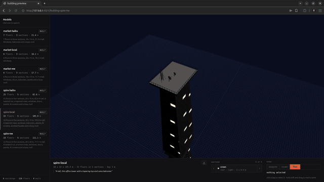

# glb-buildings-skill

Procedural building GLBs for Unreal Engine, Unity and three.js.

A building is a JSON document of floor sections, not a mesh. You edit the ground floor and rebuild, and
nothing above it moves. What comes out is plain glTF 2.0: metres, Y up, one UV set, no extensions, one mesh
and one node per section.

It is three things that fit together, and you can use any one of them on its own:

| | what it is |
| --- | --- |
| **the toolkit** | `buildings`, a CLI. Every action is one verb that answers with one JSON object |
| **the service** | a local preview server, started by `buildings preview`. A three.js page on 127.0.0.1 |
| **the skill** | the markdown an agent reads to drive the toolkit. Transport is a shell call, not MCP |

## Three drivers, two prompts

One brief, three models, the same CLI and the same skill behind each. No geometry was hand-modelled
and no document was hand-edited: every result below is verb calls.

### Opus 5

> *"a tall futuristic tower that twists as it rises, lit screens at street level, a mast and dishes
> on the roof"*


111 m, 5 sections, 34 composed elements, 5,512 triangles. A twisted run over a ribbed body, lit
screens on the street, a lattice mast and two dishes on the crown.

### Claude Haiku 4.5

> *"a six floor corner building with a glassy shop at street level, flats with balconies you can
> walk out onto above it, and plant on the roof"*


21.4 m, 3 sections, balconies down the south face, plant on the roof, 2,232 triangles. Read the
skill, ran 21 commands, one failed, recovered, done in about two and a half minutes.

### A local model, on one machine

> *"A tall, thin office tower with a tapering top and some balconies"*



106 m, 5 sections, 14 composed elements, 4,340 triangles, validator clean. Served locally on `llama.cpp`
and driven by [noob-cli](https://github.com/hec-ovi/noob-cli), with the skill installed at
`.noob/skills/`. Worth noting: it was handed a brief, wrote its own, and built that instead.

## Benchmark

Two briefs, three drivers, isolated stores so nothing raced. Every file validator clean.

| driver | building | height | sections | elements | triangles | commands | failed | wall clock |
| --- | --- | --- | --- | --- | --- | --- | --- | --- |
| Opus 5 | spire-me | 111.1 m | 5 | 34 | 5,512 | ~30 | 1 | minutes |
| Opus 5 | market-me | 17.7 m | 3 | 18 | 2,856 | ~20 | 1 | minutes |
| Haiku 4.5 | spire-haiku | 82.6 m | 5 | 21 | 2,804 | 40 | 8 | 3m 28s |
| Haiku 4.5 | market-haiku | 21.4 m | 3 | 6 | 2,232 | 21 | 1 | 2m 28s |
| gemma-4-26b | spire-local | 105.9 m | 5 | 14 | 4,340 | — | — | ~35 min |
| gemma-4-26b | market-local | 18.2 m | 3 | 1 | 72 | — | — | ~35 min |

**Reading the table.** The toolkit and skill run end to end on a locally served model through
[noob-cli](https://github.com/hec-ovi/noob-cli), with no cloud dependency: environment check,
five-section stack with a twist, facade composition, roof layout, validated glTF out. The cost is
throughput and detail density, not correctness — every output in this table passed the same proofs
and the same Khronos validation as the hosted models.

The failure column is the useful one. This benchmark is what surfaced three defects worth fixing:
two sessions sharing a store could edit each other's buildings (now scoped by `--project`); a mast
could generate itself taller than the invariant that keeps parts attached, failing a build over a
value the caller never chose (now bounded at the source); and placement required coordinate
arithmetic against a grid the caller cannot see (now `put --row --wide --tall --every`, where the
face resolves columns and steps over occupied cells). The third is the one that moves the floor for
constrained models.

## The agentic workflow

A building is decomposed into passes that share no context. Each pass has one job, one vocabulary,
and a bounded space to work in. The document on disk is the only interface between them.

**Pass one, massing.** Footprint, floor count, how the mass divides into sections, which section is
base and which is crown. It works in metres and section ids, and it runs `build` before any facade
work begins, so the support proof settles the geometry while a change is still cheap. It never
addresses a window.

**Pass two, one job per section design.** A section repeats a single floor design, so a forty floor
tower is four to six facade jobs, not forty. Each job loads one section's 10 cm grid and composes
against it. It does not need the massing rationale, the other sections, or the roof.

**Pass three, roof and services.** The deck is a named-cell floor plan; ducts, pipes and cables are
polylines with a profile.

The property that makes this work on a constrained model is that **every pass operates in a space
that rejects invalid input at the point of entry**. Cells are integers and singly-owned. Contact,
support share and triangle budget are proved before a file is written. An overlap is refused with
both parties named, not detected downstream. So no pass has to validate the pass before it, and no
pass has to be careful — correctness is a property of the surface, not of the caller.

Concretely, that is what lets a 35B model on one workstation produce a validated glTF: it is not
holding a building in its head. It is answering bounded questions against a surface that will not
let it be wrong.

## Requirements

- **Node.js 24 or newer.** The CLI runs TypeScript directly, with no build step, which is a Node 24 feature.
  Check with `node --version`.
- **npm**, to install the four dependencies (glTF Transform, three.js, esbuild, zod).
- Nothing else. No GPU to build, no network, no service account, no database.

```bash
git clone https://github.com/hec-ovi/glb-buildings-skill
cd glb-buildings-skill
npm install
npm link            # puts `buildings` on your PATH
buildings doctor    # says whether this machine can build and preview
```

If `npm link` cannot write (it needs the npm prefix, often root), put a launcher on your own PATH instead, or
skip it and call `node boxes/cli/bin/buildings.ts` in place. Full routes are in [docs/INSTALL.md](docs/INSTALL.md).

## The toolkit

```bash
buildings new tower-a --brief "a glassy corner block with flats above a shop"
buildings set-band ground --height 4.5 --tier light --columns corners
buildings set-band body --floors 22 --height 3.0

buildings face body --side S                          # the face as a grid of 10 cm cells
buildings put window --row 9 --wide 1.4 --tall 1.5 --every 3   # it works out the columns
buildings put balcony 30,2 55,15 --section ground --depth 1.4  # or name the cells outright
buildings put door 38,4 47,20 --section ground

buildings place solar B2 --section crown
buildings build
```

`buildings help` lists every verb. `buildings show` prints the stack back, and every flag you can set comes
back out, so nothing is write only. Projects live in `~/.glb-buildings`, or in a `.buildings` folder beside
your work with `new --here`, or wherever `BUILDINGS_HOME` points.

## The service

```bash
buildings preview                  # or: npm run serve
buildings preview --port 5200      # any port you like
buildings link tower-a             # http://127.0.0.1:4321/?building=tower-a
```

A plain Node HTTP server on 127.0.0.1. It serves the viewer page, the placed scene, and the built file, and
it reloads the page when the document changes on disk.

The page is three panels: the **navigator** down the side lists every building you have, the **stage** draws
it, and the **bar** along the bottom says what it is, walks its sections one at a time, and hands you the
file. Three ways to look: `blueprint` is the drawing, `model` is the drawing over the built file, `final` is
the building on its own. Click a bay to select it, hold shift and drag to mark a zone, and either lands in
`selection.json` where the CLI reads it.

`GET /api/health` answers whether the service can do its job, so something watching does not have to load a
page to find out.

## The skill

The portable unit is [`skills/glb-buildings/`](skills/glb-buildings/): one `SKILL.md` resolver that routes an
intent to one of seven fat parts. An agent holds the resolver plus one part, never all of it.

Copy the folder wherever your agent loads skills from. The transport is a shell call, so the requirement on
the host is a subprocess and a JSON parser rather than an MCP client or a plugin runtime. The trade is no
typed tool schema, which is why the drift test asserts that `SKILL.md` names every verb the CLI actually
exposes.

## Faces are grids

Every face of a section divides into 10 cm cells. A window, a door, a balcony, a panel or a lit screen is a
rectangle of them, and an element claims the cells it stands on, so two of them can never overlap and nothing
is ever placed by coordinate. A cell is asked for by column and row and comes back on the real face, so a
section that twists, tapers or curves needs no special case.

A balcony keeps its slab and its two side rails and leaves the middle open, which is exactly the space the
door onto it needs:

```
. o x x x o .
. o x x x o .
. o o o o o .   the slab, which is the floor the door stands on
```

What the section already wears holds its cells too: a rib or a cable run is kept clear, so a panel cannot be
composed straight through an upright.

Ducts, pipes and cables are one builder: a path of points carrying a ring, mitred onto the plane bisecting the
two runs at every corner. The cross section holds the whole way, and a turn too sharp to mitre is refused with
the point named.

## Nothing is written until it is proved

Every section is measured before the file exists: it has to land on the one below, close into a solid with
positive volume, agree with its own normals, keep every part it wears reaching out of it and not drifting off
it, and stay inside the triangle budget its tier promises. Then the Khronos validator runs on the bytes.

That combination is what stops inverted roofs, invisible walls, buried balconies and files an engine silently
mangles.

## How it is built

Nine boxes, each a folder with a `CONTRACT.md` that is enough to use it without reading its code. Start
at [docs/INDEX.md](docs/INDEX.md).

`spec` holds the document and the closed error set, in whole millimetres so every comparison is exact.
`assemble` lays it out. `kit` builds the geometry, the runs and the roof parts. `facade` is the cell grid on
every face. `materials` writes the textures. `check` proves the stack. `glb` writes and proves the file.
`preview` is the service. `cli` is the toolkit.

```bash
npm test        # every box, one pass
npm run doctor  # can this machine build and preview
npm run serve   # start the preview service
```

MIT licensed.
