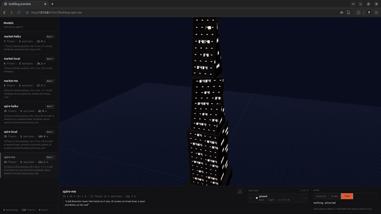
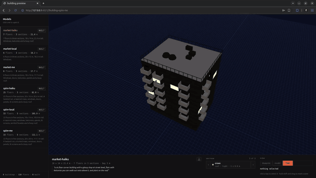
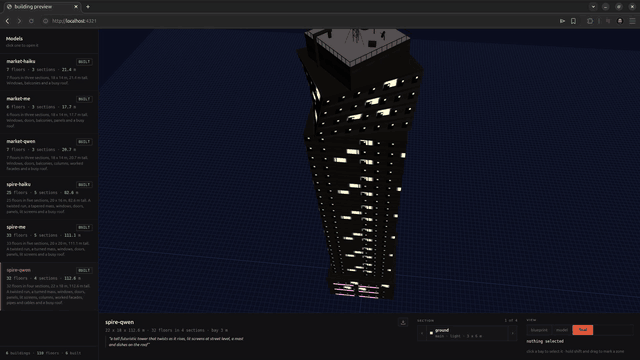

# glb-buildings-skill

Procedural building GLBs for Unreal Engine, Unity and three.js.

A building is a JSON document of floor sections, not a mesh. You edit the ground floor and rebuild, and
nothing above it moves. What comes out is plain glTF 2.0: metres, Y up, one UV set, nothing in
`extensionsRequired`, one mesh and one node per section.

It is three things that fit together, and you can use any one of them on its own:

| | what it is |
| --- | --- |
| **the toolkit** | `buildings`, a CLI. Every action is one verb that answers with one JSON object |
| **the service** | a local preview server, started by `buildings preview`. A three.js page on 127.0.0.1 |
| **the skill** | the markdown an agent reads to drive the toolkit. Transport is a shell call, not MCP |

## Three drivers, two prompts

Two briefs, three models, the same CLI and the same skill behind each. Two hosted, one on a workstation.
No geometry was hand-modelled and no document was hand-edited: every result below is verb calls.

### Opus 5

> *"a tall futuristic tower that twists as it rises, lit screens at street level, a mast and dishes
> on the roof"*



111 m, 5 sections, 34 composed elements, 5,512 triangles. A twisted run over a ribbed body, lit
screens on the street, a lattice mast and two dishes on the crown.

### Claude Haiku 4.5

> *"a six floor corner building with a glassy shop at street level, flats with balconies you can
> walk out onto above it, and plant on the roof"*



21.4 m, 3 sections, balconies down the south face, plant on the roof, 2,232 triangles. Read the
skill, ran 21 commands, one failed, recovered, done in about two and a half minutes.

### Qwen3.6-35B-A3B, local

> *"a tall futuristic tower that twists as it rises, lit screens at street level, a mast and dishes
> on the roof"*



112.6 m, 4 sections, 57 elements, 10,576 triangles, validator clean, in 6m 15s. The densest facade in
the set. Q8_0 on one workstation, driven by [noob-cli](https://github.com/hec-ovi/noob-cli).

## Benchmark

Two briefs, three drivers, a store each so nothing raced. Every file validator clean.

| driver | building | height | sections | elements | triangles | calls | failed | time |
| --- | --- | --- | --- | --- | --- | --- | --- | --- |
| Opus 5 | spire-me | 111.1 m | 5 | 34 | 5,512 | ~30 | 1 | — |
| Opus 5 | market-me | 17.7 m | 3 | 18 | 2,856 | ~20 | 1 | — |
| Haiku 4.5 | spire-haiku | 82.6 m | 5 | 21 | 2,804 | 40 | 8 | 3m 28s |
| Haiku 4.5 | market-haiku | 21.4 m | 3 | 6 | 2,232 | 21 | 1 | 2m 28s |
| Qwen3.6-35B (local) | spire-qwen | 112.6 m | 4 | 57 | 10,576 | 127 | 11 | 6m 15s |
| Qwen3.6-35B (local) | market-qwen | 20.7 m | 3 | 19 | 3,236 | 223 | 13 | 9m 15s |

Local runs: Q8_0 on one Strix Halo box, served through
[llama-vulkan-strix](https://github.com/hec-ovi/llama-vulkan-strix), driven by
[noob-cli](https://github.com/hec-ovi/noob-cli). Time is the whole session, skill reading and retries
included.

The local model takes more calls to get there and produces more geometry when it does. Everything in
the table cleared the same proofs and the same validator.

The failure column paid for itself. It found three defects: two sessions sharing a store could edit
each other's buildings (now `--project`), a mast could generate itself taller than the invariant that
keeps parts attached (now bounded), and placing anything meant coordinate arithmetic against a grid
you cannot see (now `put --row --wide --tall --every`).

## The agentic workflow

A building is three passes that share no context. The document on disk is the only thing between them.

**Massing.** Footprint, floors, how the mass splits into sections. Works in metres and section ids, and
builds once so the support proof settles the shape while changing it is still cheap. Never touches a
window.

**One job per section design.** A section repeats a single floor, so a forty floor tower is four to six
jobs, not forty. Each one loads a single 10 cm grid and composes against it.

**Roof and services.** The deck is a floor plan of named cells; ducts, pipes and cables are paths.

What makes it work on a small model is that each pass writes into a space that refuses bad input at the
door. Cells are integers and owned by one thing. Contact, support and triangle budget are proved before
a file exists. An overlap comes back naming both parties. So no pass checks the pass before it, and none
of them has to be careful.

## Requirements

- **Node.js 24 or newer.** The CLI runs TypeScript directly, with no build step, which is a Node 24 feature.
  Check with `node --version`.
- **npm**, to install the dependencies (glTF Transform, the Khronos validator, three.js, esbuild, zod).
- Nothing else. No GPU to build, no network, no service account, no database.

```bash
git clone https://github.com/hec-ovi/glb-buildings-skill
cd glb-buildings-skill
npm install
npm link            # puts `buildings` on your PATH
buildings doctor    # says whether this machine can build and preview
```

If `npm link` cannot write (it needs the npm prefix, often root), put a launcher on your own PATH instead, or
skip it and call `node boxes/cli/bin/buildings.ts` in place. Full routes are in [docs/INSTALL.md](docs/INSTALL.md).

## The toolkit

```bash
buildings new tower-a --brief "a glassy corner block with flats above a shop"
buildings set-band ground --height 4.5 --tier light --columns corners
buildings set-band body --floors 22 --height 3.0

buildings face body --side S                          # the face as a grid of 10 cm cells
buildings put window --row 9 --wide 1.4 --tall 1.5 --every 3   # it works out the columns
buildings put balcony 30,2 55,15 --section ground --depth 1.4  # or name the cells outright
buildings put door 38,4 47,20 --section ground

buildings place solar B2 --section crown
buildings build
```

`buildings help` lists every verb. `buildings show` prints the stack back, and every flag you can set comes
back out, so nothing is write only. Projects live in `~/.glb-buildings`, or in a `.buildings` folder beside
your work with `new --here`, or wherever `BUILDINGS_HOME` points.

## The service

```bash
buildings preview                  # or: npm run serve
buildings preview --port 5200      # any port you like
buildings link tower-a             # http://127.0.0.1:4321/?building=tower-a
```

A plain Node HTTP server on 127.0.0.1. It serves the viewer page, the placed scene, and the built file, and
it reloads the page when the document changes on disk.

The page is three panels: the **navigator** down the side lists every building you have, the **stage** draws
it, and the **bar** along the bottom says what it is, walks its sections one at a time, and hands you the
file. Three ways to look: `blueprint` is the drawing, `model` is the drawing over the built file, `final` is
the building on its own. Click a bay to select it, hold shift and drag to mark a zone, and either lands in
`selection.json` where the CLI reads it.

`GET /api/health` answers whether the service can do its job, so something watching does not have to load a
page to find out.

## The skill

The portable unit is [`skills/glb-buildings/`](skills/glb-buildings/): one `SKILL.md` resolver that routes an
intent to one of eight fat parts. An agent holds the resolver plus one part, never all of it.

Copy the folder wherever your agent loads skills from. It talks to the CLI by running it, so the host needs
a subprocess and a JSON parser, not an MCP client. A test keeps `SKILL.md` naming every verb the CLI has.

## Faces are grids

Every face divides into 10 cm cells. A window, a door, a balcony, a panel or a lit screen is a rectangle of
them, and each one claims the cells it stands on, so two can never overlap. A cell is asked for by column and
row and comes back on the real face, so a twist or a taper needs no special case.

A balcony keeps its slab and its two side rails and leaves the middle open, which is exactly the space the
door onto it needs:

```
. o x x x o .
. o x x x o .
. o o o o o .   the slab, which is the floor the door stands on
```

Ribs and cable runs hold their cells too, so nothing gets composed through an upright.

Ducts, pipes and cables are one builder: a path of points carrying a ring, mitred at every corner. The cross
section holds the whole way, and a turn too sharp to mitre is refused with the point named.

## Finishes, and two modes

Every named surface has a finish, and a building wears one of two families: `modern` or `cyber`. A family
is a sheet of colours and a wear number, and one set of texture templates draws both, so the same `concrete`
is pale precast on a curtain wall tower and dark stained concrete on a megastructure. Textures are written
from code, seeded from the building's name, and stay under 40 kB a tile.

```bash
buildings style cyber      # dark mass, hard little windows in cyan, amber and red
buildings textures off     # no images at all: named flat colour slots for your own materials
```

A folder of generated images per family stands in for the drawn tiles, and anything the folder lacks stays
drawn. A finish can hold several pictures (`facade_1` to `facade_4`) and a building picks one from its own
seed, so a street of towers does not wear one wall.
[docs/textures/PROMPTS.md](docs/textures/PROMPTS.md) is how those get generated.

## A night city

Three parts span floors rather than repeating on each one, which is what a lit tower needs.

```bash
buildings line body --side S --count 5 --spacing 3.5 --colours cyan,magenta,red
buildings screen body --side E --along 3 --width 8 --from 6 --to 18 --image screen1.png
buildings crown crown --colour red
```

A `line` is a lit run climbing a face, several across it, each tinted from one white tile. A `screen` stands
off a face with nothing holding it, carries its own picture behind a tile of dotted glass, and gets its own
material slot so an engine can bind a video to it. A `crown` runs round the top edge. A `bulk-glass` section is four or five floors of nothing but lit glazing
in an otherwise dark tower. Every `cyber` roof stands a mast with a lit tip whether you ask for one or not,
because that is what puts a tower against the sky.

## Nothing is written until it is proved

Every section is measured before the file exists. It has to land on the one below, close into a solid with
positive volume, agree with its own normals, keep every part it wears reaching out of it and not drifting off
it, and stay inside its tier's triangle budget. Then the Khronos validator runs on the bytes.

That is what stops inverted roofs, invisible walls, buried balconies and files an engine quietly mangles.

## How it is built

Nine boxes, each a folder with a `CONTRACT.md` that is enough to use it without reading its code. Start
at [docs/INDEX.md](docs/INDEX.md).

`spec` holds the document and the closed error set, in whole millimetres so every comparison is exact.
`assemble` lays it out. `kit` builds the geometry, the runs and the roof parts. `facade` is the cell grid on
every face. `materials` is the finish library. `check` proves the stack. `glb` writes and proves the file.
`preview` is the service. `cli` is the toolkit.

```bash
npm test        # every box, one pass
npm run doctor  # can this machine build and preview
npm run serve   # start the preview service
```

MIT licensed.
